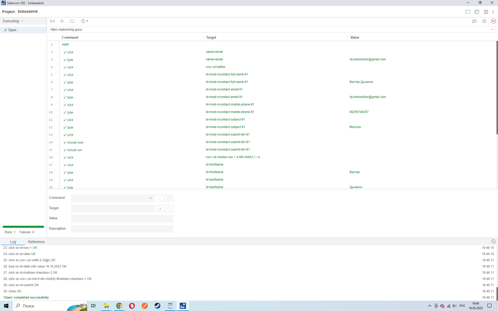

# Sobasednik

___

## О проекте 

Проект является итоговой работой обучения в Омском государственном университете по программе повышения квалификации "Тестировщик программного обеспечения".

Для проведения тестирования был выбран сайт "Собаседник" https://qahacking.guru/

### Инструменты с которыми работал в процессе обучения: 

+ XMind
+ TestRail
+ Jira
+ Selenium IDE
+ PyCharm
+ Язык Python
+ Postman 
+ MySQL
+ GIT 

___

## Содержание итоговой работы

+ Майнд-карта жизненного цикла тестирования ПО;
+ Майнд-карта одной из методологий разработки ПО (инкрементальная модель);
+ Тестовая документация (чек-лист, тест-кейсы, баг-репорты);
+ Автотест;
+ Результат выполнения автотеста;
+ Анализ результатов тестирования выбранного приложения;
+ Выводы об оптимальности выбранной стратегии тестирования;

___

## Майнд-карта жизненного цикла тестирования ПО

___

## Майнд-карта одной из методологий разработки ПО (инкрементальная модель)

___

## Тестовая документация 

### Чек-лист

По учебному плану требовалось создать чек-лист, а после этого применить техники тест-дизайна и добавить изменения в уже имеющийся документ. 

С полным чек-листом можно ознакомиться по ссылке:

https://docs.google.com/document/d/1sF4DsD4tK-3ZF7LUMYyhMd4K0ij1JMQO3Q5zaxf35XM/edit?usp=share_link

### Тест-кейсы

Тест-кейсы создавались при помощи TestRail, но для удобства просмотра файл был сохранен с возможностью открытия в Office. 
По учебному плану, как и в случае с чек-листом, требовалось создать тест-кейсы, а после этого применить техники тест-дизайна и добавить изменения в уже имеющийся документ. Применение техник тест-дизайна позволило сократить колличество тестов, но при этом не потерять в тестовом покрытии. 

Все тест-кейсы можно посмотреть по ссылке:

https://docs.google.com/spreadsheets/d/1T9-Kq29XGw4cAEmKFbRbyuj3BE1mimns/edit?usp=share_link&ouid=103864051407925571067&rtpof=true&sd=true

### Баг-репорт

На основании проведеных тестов были созданы баг-репорты при помощи Jira

Все баг-репорты можно увидеть по ссылке:

https://docs.google.com/document/d/1Z-pAwgr6yAXszgsFFeNEYEKbivIg9rat/edit?usp=share_link&ouid=103864051407925571067&rtpof=true&sd=true

___

## Автотест

### Selenium IDE 

В первую очередь были составлены автотесты при помощи раширения Selenium IDE

### PyCharm

На основании полученных тестов, код был видоизменен на языке Python в PyCharm

### Результат выполнения автотеста

В конечно результате был получен следующий результат:

___

## Анализ результатов тестирования выбранного приложения 

В ходе проверки сайта “Собаседник” было составлено 188 тест-кейсов. Выявлено 45 деффектов, 4 тест-кейса заблокированы. На данный момент релиз платформы не рекомендуется. Необходимо провести правки основного функционала.

___

## Выводы об оптимальности выбранной стратегии тестирования

В связи с отсутствием требований, макетов сайта и прочей документации было невозможно построить четкую стратегию проведения тестирования. Благодаря выбранной стратегии тестирования, в частности, проведение функционального, UI/UX тестирований, были выявлены дефекты сайта,  а использование техник тест-дизайна позволило максимизировать тестовое покрытие, добиться высоких результатов и обнаружить слабые места сайта.

